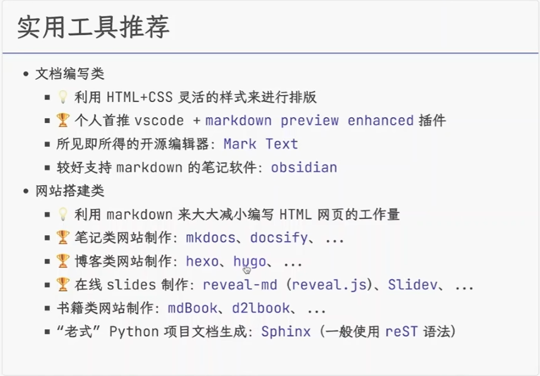

## 2 扩展语法

在john的原始设计文档中概况的基本语法主要是为了大多数情况下日常所需的元素，但是某些场景下还不够。

一些个人和组织开始通过添加其他元素来扩展基本语法

### 2.1 表格
- 不在标准之中，单一般这样使用
- 每个单元格使用 |  分隔开

Tables Generator 

### 2.2 角注

### 2.3 任务列表

### 2.4 公式

html 保留公式文本，交个mathjax或者katex等js库来处理  

$a^2 + b^2 = c^2$

### 3.5 流程图，时序图，甘特图
一般使用mermaid.js来处理

实用工具推荐
