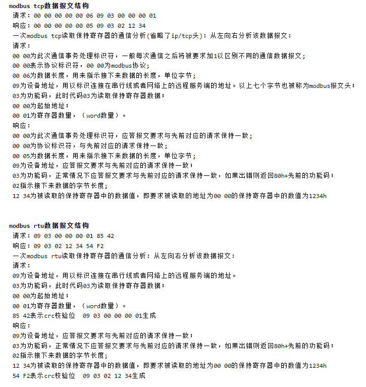
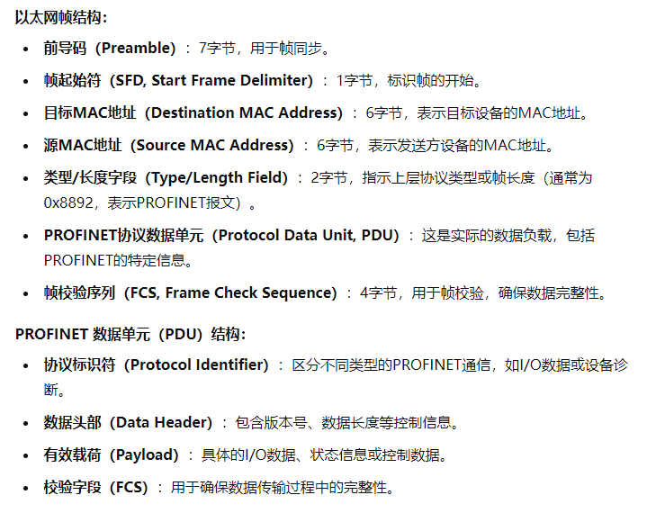

## Modbus 协议 (施耐德 Modicon开发)

### 特性
1. 主从架构，Master设备向Slave设备发起通讯请求，Slave设备响应请求并返回响应结果
2. 开放和标准化
3. 灵活的通信协议，支持多种通信方式，包括串口，TCP/IP，RS-485，等等
4. 功能码，如读写线圈，寄存器或诊断命令
   
## 场景 

工厂自动化系统中的PLC与传感器，执行器之间，SCADA与现场设备，楼宇自动化中

- 优点
  - 简单易用，方便调试
  - 开放和标准，广泛的技术资料和支持
  - 可用于多种物理介质，如串口，以太网等
  
- 缺点
  - 安全性不高尤其是在网络化应用中
  - 数据传输的速度和效率在复杂应用中限制较大
  - 不适合大规模数据传输或高实时性要求

### 消息结构

CRC校验码是根据消息内容自动生成的，用于检测数据传输过程中是否出现错误。ModbusTcp协议中不需要CRC校验码，因为TCP协议本身就有校验机制。

## Profibus 协议 （西门子主推）

### 主要特性
1. 实时通讯协议
2. 主从通讯架构或分布式架构
3. 多个变种，Profibus-DP 工厂自动化,Profibus-PA 过程自动化

### 对比
1. 与Modbus协议相比，更高的通讯传输速率和更加复杂的网络拓扑，适合更高性能和更大规模的系统
2. 与Ethernet,Profinet协议相比，Profibus逐渐被这些实时以太网协议取代，这些协议提供了更好的集成性和灵活性。

### Profibus-DP

1. 通讯模型，主从通信模型
2. 通信速率：PROFIBUS-DP支持多种通信速率，从9.6 kbps到12 Mbps不等
3. 传输距离：最大传输距离取决于通信速率。通信速率越高，允许的传输距离越短。例如，在12 Mbps时，最大传输距离为100米；而在9.6 kbps时，最大传输距离可以达到1200米。中继器可以增加总的传输距离
4. 数据传输，数据帧结构紧凑，包括报文头，地址字段，功能码，数据字段，校验字段，周期性交换数据。
5. 设备地址，范围0-126，0为广播地址。主站通过GSD文件来管理从站设备。

 ## Profinet协议

 Profinet协议是基于以太网的协议，由西门子开发，是工业控制领域的主流协议。

 - TCP/IP通信：用于非实时通信，例如工程配置、设备参数化、数据传输等。
- 实时通信（RT, Real-Time）：用于大多数工业自动化中的控制任务，提供快速和确定性的通信。
- 等时实时通信（IRT, Isochronous Real-Time）：用于高精度、同步和时间敏感的应用，例如运动控制，提供严格的实时性。

通信设备可以分为3类： IO-CONTROLLER, IO-DEVICE, IO-SUPERVISOR。

支持非常灵活的网络拓扑结构，如线型，星型，环型等。

### 报文格式

PROFINET报文是基于标准的IEE 802.3以太网帧，并在其上增加了PROFINET专用字段。

以太网帧结构：

---
# EtherCAT [1](https://zhuanlan.zhihu.com/p/406428272?utm_id=0 "知乎EtherCAT")

传统以太网不能达到实时性的原因：带宽利用率 协议栈延时 交换机延时

## 链路层

 主站：普通网卡即可，主要是通过软件实现

 从站硬件：ESC芯片（EtherCAT Slave Controller） + MCU 

ESC芯片 外挂的EEPROM存储器可以保存芯片初始化的寄存器配置

### 数据帧格式

标准的以太网帧修改而来，增加了带宽

与TCP/IP的分层格式区别是减去了网络层和传输层的帧头以及处理过程。

第三行中的子报文中的“数据”段就是属于应用层的内容（一个邮箱的数据），其他部分都是由EtherCAT的链路层进行解析的，MCU不需要也无法参与其解析工作。

### 链路层通讯机制

问题： EtherCAT通信链路层的通信“目标”是什么？，到底交换什么东西，数据又是如何呈现的？

EtherCAT的链路层定义每一个设备都有一个数据空间（DPRAM）,范围为0x0000~0xFFFF,主站与从站通信目标就是能够读写这段空间内允许被访问的数据。 数据空间存在于从站的ESC芯片中，主站和从站的MCU都可以访问这段空间（需SM进行管理？），从而作为中间缓存提供给应用层和主站之间建立起通信的桥梁。

1. 主站与从站ESC芯片通信，通知MCU数据的到达等功能。
2. 从站MCU与ESC芯片通信。

第一步就是链路层的通讯机制需要实现的内容，靠子报文来实现。一个完整EtherCAT数据包中可以有多个子报文，这里的多个子报文并不是指有几个从设备就一定对应着有几个子报文，而是每个子报文中都有自己的指令逻辑可以寻址找到要通信的从站。

#### 子报文说明

主站发出的子报文通过 命令+地址区+长度 寻址到目标从设备 从而对数据区的内容进行读，写操作。

命令码 = 寻址方式 + 读写数据模式 15中
寻址方式 = 顺序寻址（网络初始化）+ 设置寻址 + 广播寻址 + 逻辑寻址 

#### 存储同步管理SM

从链路层的通信机制了解到了主站是如何与从站ESC芯片的物理空间进行数据交互的。 问题: ESC的物理空间主站可以操作，从站MCU也可以操作，如何保证两者的操作的正确性以及通知对方另一方有最新的操作需要处理？

ESC芯片中的一个功能模块SM来解决，SM用于阻止从站和主站MCU同时访问ESC存储区，确保数据的一致性，以及通知MCU数据到达等功能。也就是从站MCU与主站间的通讯需要指定ESC的物理空间作为缓存，那么这片缓存必然要被SM进行管理才可以合理的使用，**SM管理的区域就是从站MCU应用层与主站之间通信交互通道**。 

也有专门的寄存器进行配置。

具体参考芯片手册，SM中可以配置它所管理的物理地址，可以配合FMMU共同指向某片物理空间，使这片空间既可以被逻辑寻址所访问，也同时受到SM的管理。

1. 当SM配合FMMU共同指向一片物理空间的情况，就是用来传输周期性过程数据的，也就是PDO数据。此时SM中的运行模式配置为3个缓存区以保证数据的一致性。从站MCU通过分别使用SM2和SM3两个通道来接收和发送主站的数据所指向的物理空间由于有FMMU映射，可以使用逻辑寻址进行访问。

2. 当SM不配合FMMU共同来管理一片物理空间时，就是用来传输“非周期性数据”的，也就是“邮箱数据”，此时SM中的运行模式配置为1个缓存区，而从站MCU通过分别使用SM0和SM1两个通道来接收和发送主站的数据以避免读写冲突。这一片物理空间由于没有FMMU管理，所以不能使用逻辑寻址访问，而是通过设置寻址进行访问的。

## 应用层

EtherCAT 应用层协议支持 VOE/FOE/EOE/COE等

下面以CanOpen Over EtherCAT为例进行说明

# CAN  [2](https://www.cnblogs.com/Asp1rant/p/18173257 "CAN")

Controller Area Network, 车用网络通信协议，由Bosch设计，91年发布为标准。

车辆内部通信，工业自动化，医疗设备，嵌入式系统。

可靠性高，实时性，低成本。 支持多主通信和错误检测机制，抗干扰能力强。

### 工作原理

1. 物理层(Physical Layer)：CAN 使用差分信号在总线上传输数据，定义了物理层的电气特性，如电压电平、电缆长度等。

2. 数据链路层(Data Link Layer)：CAN 协议主要在数据链路层进行定义，包括:

- 帧格式:定义了 CAN 帧的不同类型，如数据帧、远程帧、错误帧等。
- 访问控制:采用 CSMA/CR(Carrier Sense Multiple Access with Collision Resolution)机制，支持多个节点争用总线并通过仲裁解决冲突。
- 差错检测:包括位错误、帧错误、确认错误等，并定义了错误处理机制。

3. 网络层(Network Layer)和更高层:CAN 协议主要集中在物理层和数据链路层，并没有定义网络层和更高层的内容。这些功能需要由上层协议(如 CANopen、DeviceNet 等)来实现。

4. 应用层(Application Layer)：CAN 协议本身不定义应用层的内容，而是由上层协议(如 CANopen、DeviceNet)来定义应用层的功能，如报文格式、网络管理等。

总的来说，CAN 协议主要在 OSI 模型的物理层和数据链路层进行定义，为上层协议提供可靠的串行总线通信服务。上层协议则负责实现网络层及以上的功能。这种分层设计使 CAN 协议灵活适用于不同的应用场景。

CAN总线协议有 ISO-11898 和 ISO-11519两个系列。其定义有：

ISO-11898 定义了通信速率为 125 kbps ~1Mbps 的高速 CAN 通信标准，属于闭环总线，传输速率可达1Mbps，总线长度 ≤ 40米。
ISO11519 定义了通信速率为 10～125 kbps 的低速 CAN 通信标准，属于开环总线，传输速率为40kbps时，总线长度可达1000米。

**CAN 总线支持多主工作方式，也就是说多个节点可以同时作为主设备来发送数据帧。**

1. 仲裁机制
2. 优先级机制
3. 仲裁过程

### 数据帧格式

标准帧格式（标准数据帧 扩展数据帧 标准远程帧 扩展远程帧）

特殊帧模式（错误帧 过载帧）

