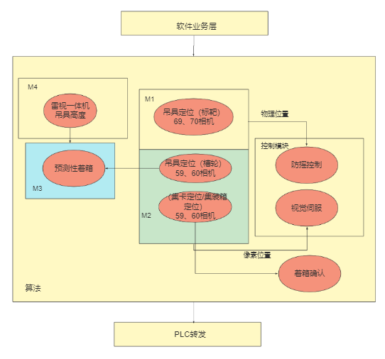

## 控制服务

- M1 吊具定位服务（标靶）
- M2 吊具定位（槽轮），集卡/集装箱定位
- M3 预测性着箱
- M4 吊具高度定位服务
- M5 着箱控制感知服务

MCS  Movement Control System

40尺集装箱柜是（GB型）：

内长度12.032米，内宽度2.352米，内高度2.385米。

外长度12.192米，外宽度2.438米，外高度2.591米。

40尺集装箱柜是（GC/HG（高柜））：

内长度12.032米，内宽度2.352米，内高度2.690米。

外长度12.192米，外宽度2..438米，外高度2.896米。

40尺集装箱柜是（OT（开顶））：

内长度12.034米，内宽度2.352米，内高度2.330米。

外长度12.192米，外宽度2.438米，外高度2.591米。

export INFLUX_TOKEN=5MqWNvrfQKjCS4PbCJacmkeEJ5v25-RSSIMqvdHT1VcwvrvT0GlB1NVWLNTvcEG224yMbmFOVhrjiV996GxGJw==

telegraf --config http://10.0.0.74:8086/api/v2/telegrafs/0d4997e89f8fc000

