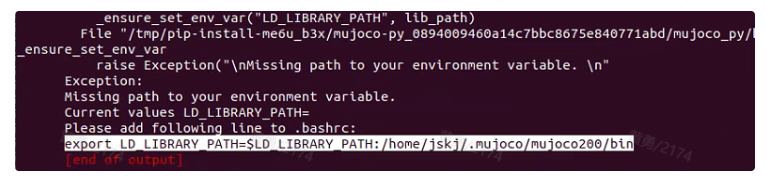
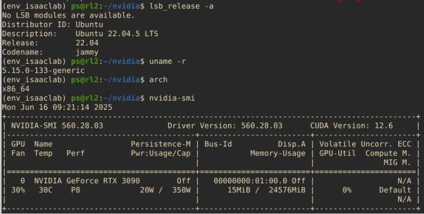

在 Ubuntu 20.04 上安装 **Docker Engine** 和 **Docker Desktop** 可以分两步进行。以下是最推荐的做法，确保系统干净、安装方式官方且稳定：

---

## ✅ 一、安装 Docker Engine（社区版）

### 1. 卸载旧版本（如已装）

```bash
sudo apt-get remove docker docker-engine docker.io containerd runc
```

---

### 2. 设置 Docker 仓库

```bash
sudo apt-get update
sudo apt-get install -y ca-certificates curl gnupg lsb-release
```

添加 GPG 密钥：

```bash
sudo mkdir -p /etc/apt/keyrings
curl -fsSL https://download.docker.com/linux/ubuntu/gpg | \
sudo gpg --dearmor -o /etc/apt/keyrings/docker.gpg
```

设置仓库源：

```bash
echo \
  "deb [arch=$(dpkg --print-architecture) \
  signed-by=/etc/apt/keyrings/docker.gpg] \
  https://download.docker.com/linux/ubuntu \
  $(lsb_release -cs) stable" | \
  sudo tee /etc/apt/sources.list.d/docker.list > /dev/null
```

---

### 3. 安装 Docker Engine 最新版

```bash
sudo apt-get update
sudo apt-get install -y docker-ce docker-ce-cli containerd.io docker-buildx-plugin docker-compose-plugin
```

---

### 4. 验证安装

```bash
sudo docker run hello-world
```

若输出成功信息说明安装完成。

---

### 5. 让当前用户无需 `sudo` 运行 Docker（可选）

```bash
sudo usermod -aG docker $USER
newgrp docker  # 或重新登录终端
```

---

## ✅ 二、安装 Docker Desktop（图形界面）

### ⚠️ 前提要求：

* 必须启用 **WSL2 或 systemd**（Ubuntu 20.04 默认支持）
* 建议安装 `gnome-shell` 桌面环境（或 KDE 等）

---

### 1. 安装前准备

先安装依赖项：

```bash
sudo apt install -y apt-transport-https ca-certificates curl software-properties-common
```

### 2. 下载 Docker Desktop `.deb` 安装包

前往官网下载：

👉 [https://www.docker.com/products/docker-desktop/](https://www.docker.com/products/docker-desktop/)

下载适用于 Linux 的 `.deb` 包（例如 `docker-desktop-<version>-amd64.deb`）

或者使用 `wget` 下载：

```bash
wget https://desktop.docker.com/linux/main/amd64/docker-desktop-<version>-amd64.deb
```

（用真实版本替换 `<version>`）

---

### 3. 安装 Docker Desktop

```bash
sudo apt install ./docker-desktop-<version>-amd64.deb
```

---

### 4. 启动 Docker Desktop

首次运行：

```bash
systemctl --user start docker-desktop
```

或者在 GUI 中搜索 "Docker Desktop" 并启动。

---

### 5. 设置开机启动（可选）

```bash
systemctl --user enable docker-desktop
```

---

## ✅ 三、验证 Docker Desktop 是否正常运行

```bash
docker version
docker info
```

Docker Desktop 提供了图形化界面用于容器管理和配置，访问 `localhost:2375`（如果开启了该功能）可以与其他客户端集成。

---

## 🔧 常见问题

| 问题                                    | 解决方法                                                    |
| ------------------------------------- | ------------------------------------------------------- |
| `Cannot connect to the Docker daemon` | 确保 Docker Desktop 已启动，或执行 `sudo systemctl start docker` |
| 图形界面无法打开                              | 确保你当前是桌面环境，或通过 `X11` 启动图形界面                             |
| Docker Desktop 无法启动                   | 查看日志 `~/.docker/desktop/logs/`，确认是否 systemd 配置不当        |

---

如果你告诉我是用于服务器无桌面的环境，还是需要 GUI 的开发者环境，我可以进一步帮你裁剪或精简安装方案。是否需要我写一份一键脚本？


# 仿真环境

好的，我们来一步一步、**稳健地迁移你的 Conda Python 环境**，从 Ubuntu 18 → Ubuntu 20，**目标是稳定、可维护且可复现**。这个方案适合团队协作部署，能最大程度规避“包版本冲突”、“安装失败”、“依赖编译问题”。

---

## ✅ **最佳方案：分步迁移（稳定可靠）**

---

### 📍 第一步：在原机器导出 pip 依赖列表（可复现）

1. 激活你的 Conda 环境：

   ```bash
   conda activate mcs_env
   ```

2. 导出 Python 版本和 Conda 包：

   ```bash
   conda list --export > conda_list.txt
   ```

3. 仅导出 pip 安装的包（忽略 Conda 安装的）：

   ```bash
   pip freeze > requirements.txt
   ```

这样我们就有了两个文件：

| 文件                 | 用途                             |
| ------------------ | ------------------------------ |
| `conda_list.txt`   | 基础包列表（含 Python、cffi、openssl 等） |
| `requirements.txt` | pip 包依赖（tf、gym、matplotlib 等）   |

---

### 📍 第二步：在新服务器上构建 Conda 环境

#### 1. 安装 Miniconda/Anaconda（略）

#### 2. 手动构建基础环境：`base_env.yml`

创建如下内容：

```yaml
name: mcs_env
channels:
  - defaults
dependencies:
  - python=3.8
  - pip
  - setuptools
  - wheel
  - cffi
  - ncurses
  - readline
  - zlib
  - tk
  - openssl
  - libffi
```

保存为 `base_env.yml`，然后运行：

```bash
conda env create -f base_env.yml
conda activate mcs_env
```

---

### 📍 第三步：使用 pip 安装项目依赖（分步骤）

#### 1. 安装核心 pip 包

创建精简后的 `requirements_core.txt`（主要是你依赖的主框架）：

```txt
tensorflow==2.13.0
tensorflow-probability==0.20.1
tf-agents==0.17.0
mujoco-py==2.0.2.13
gym==0.23.0
scipy==1.10.1
matplotlib==3.7.2
pandas==2.0.3
```

然后：

```bash
pip install -r requirements_core.txt
```

> 这些是比较容易编译失败的依赖，单独处理更好 debug。

#### 2. 安装剩下的依赖：

```bash
pip install -r requirements.txt --no-deps
```

`--no-deps` 是关键，避免 pip 重复安装已由 Conda 管理的低层依赖（如 `numpy`, `cffi`, `zlib` 等）。

---

### 📍 第四步：验证环境

你可以用以下命令检查：

```bash
python -c "import tensorflow as tf; print(tf.__version__)"
python -c "import mujoco_py; print('MuJoCo OK')"
```

---

### ✅ 附加建议

* 保持 Python 3.8，是为了确保原始兼容性（tensorflow==2.13 支持 3.8 / 3.9）
* Mujoco 依赖 `GLFW`, 记得：

  ```bash
  sudo apt install libglfw3 libglfw3-dev libglew-dev
  ```

---

### 在安装mujoco-py==2.0.2.13时问题较多

- 各种依赖缺失问题，根据错误安装对应的依赖版本文件

- 将mujoco相关文件复制到~/.mujoco目录下

- 修改并更新.bashrc文件，修改环境变量

- 启动仿真时无界面ERROR: GLEW initialization error: Missing GL version 

LD_PRELOAD=/usr/lib/x86_64-linux-gnu/libGLEW.so ./run_sim.sh -s image -e qc_y4




```bash
# bash 记录参考

ubuntu 20.04 conda 25.5.0 py3.8

conda env create -f base_env.yml
conda activate mcs_env

pip install -r requirements_core.txt
source ~/.bashrc

pip uninstall cython
pip install cython==0.29.36
sudo apt install libosmesa6-dev libgl1-mesa-glx libglfw3 libglfw3-dev patchelf

pip install 'mujoco-py==2.0.2.13' --no-build-isolation
export MUJOCO_PY_MUJOCO_PATH=~/.mujoco/mujoco210
export LD_LIBRARY_PATH=$MUJOCO_PY_MUJOCO_PATH/bin:$LD_LIBRARY_PATH

# <<< mujoco initialize <<<
export LD_LIBRARY_PATH=$LD_LIBRARY_PATH:/home/jskj/.mujoco/mujoco210/bin:/usr/lib/x86_64-linux-gnu/libGLEW.so
export LD_PRELOAD=/usr/lib/x86_64-linux-gnu/libGLEW.so
# <<< mujoco initialize <<<

pip install -r requirements.txt --no-deps


LD_PRELOAD=/usr/lib/x86_64-linux-gnu/libGLEW.so ./run_sim.sh -s image -e qc_y4
```

推理服务器环境




# 推理环境搭建

### conda环境

从248上导出的文件，使用YAML文件创建环境，conda会自动处理所有的依赖关系

```bash
conda env create -f env.yml
```

### install cuda11.6

[Nvidia ccuda](https://developer.nvidia.com/cuda-11-6-0-download-archive?target_os=Linux&target_arch=x86_64&Distribution=Ubuntu&target_version=20.04&target_type=deb_network )

```bash
wget https://developer.download.nvidia.com/compute/cuda/repos/ubuntu2004/x86_64/cuda-ubuntu2004.pin
sudo mv cuda-ubuntu2004.pin /etc/apt/preferences.d/cuda-repository-pin-600
sudo apt-key adv --fetch-keys https://developer.download.nvidia.com/compute/cuda/repos/ubuntu2004/x86_64/7fa2af80.pub
sudo add-apt-repository "deb https://developer.download.nvidia.com/compute/cuda/repos/ubuntu2004/x86_64/ /"
sudo apt-get update
sudo apt-get -y install cuda-11-6

设置环境变量
echo 'export PATH=/usr/local/cuda-11.6/bin:$PATH' >> ~/.bashrc
echo 'export LD_LIBRARY_PATH=/usr/local/cuda-11.6/lib64:$LD_LIBRARY_PATH' >> ~/.bashrc
source ~/.bashrc
```

### install tensorrt=8.4.3.1

[TensorRT ](https://developer.nvidia.com/nvidia-tensorrt-8x-download) 

see document and use tar package insatll

### install cuDNN 8.9.7

[cuDNN 8.9.7 ](https://developer.nvidia.com/rdp/cudnn-archive) 

```bash

# 参考指令 localinstaller tar

tar -xzvf cudnn-linux-x86_64-*.tgz
sudo cp cuda/include/cudnn*.h /usr/local/cuda/include/
sudo cp -P cuda/lib64/libcudnn* /usr/local/cuda/lib64/
sudo chmod a+r /usr/local/cuda/include/cudnn*.h /usr/local/cuda/lib64/libcudnn*

```

### 推理部分至此测试ok 

ubuntu22.04 cuda12.6 TensorRT-10.3.0.26 环境

ubuntu18.04 cuda10.2.89 TensorRT-8.4.3.1

ubuntu20.04 cuda11.6 TensorRT-8.4.3.1 cuDNN 8.9.7 miniconda canda 25.5.1

```bash

python detect.py --weights .*.engine.fp16  --source */ --imgsz 640 --rect

必选参数：
--weights 模型的路径
--source 待推理数据的路径
--imgsz 模型推理图像的尺寸，根据模型文件中倒数第二个数字进行设定，例如模型文件为20240821_yangsi_neijika_v10m_640_384.engine.fp16，则此处输入640

以下为可选参数：

--rect 用来控制模型输入图片是矩形还是方形，根据模型名称来确定，如果模型最后用来描述图片形状的名称为640_384，则代表输入图片为640*384的矩形图片，需要在代码后面加上--rect，如果为640_640则代表图片为640*640的方形图片，此时忽略此参数。
--conf-thres 置信度，默认为0.4, 用来过滤输出结果，越接近1结果越可信但正确的输出结果可能也会被过滤掉
--vid-stride 推理视频时，如果视频过长，可设置每几帧推理1帧，如果设为2则每2帧推理1帧
--draw_style 可设为point_all, rectangle_all, point_1,2,3, rectangle_1,2,3。此参数用来设置推理结果的可视化效果，是否将结果画为框或者点。如果point_all则将每一输出类别的结果都画为点；rectangle_all则都画为框；point_1,2,3则将输出结果中的1,2,3类画为点其余类为框；rectangle_1,2,3则将输出结果中的1,2,3类画为框其余类为点。

# 常见代码问题
# 1 提示context有错 解决方案：重新导出engine，执行以下代码
python onnx2tensorrt.py --weights weights/20240522-yangsi-cemian-fangxiang-v5l-544-960.onnx --fp16

# 2图片尺寸报错AssertionError: Input shape should be between (1, 3, 384, 640) and (1, 3, 384, 640) but get (1, 3, 640, 640). 
代码后加入--rect参数

python detect.py --weights *.engine.fp16  --source * --imgsz 640 --rect

```

177 5d9a909e 服务器上测试推理部分也没问题，需要准备好数据集即可进行推理，不过GPU 内存不够大训练的训练的效果较差


## engine模型在数据集上的评测\

```
engine模型在数据集上的评测


1.子奔提供一个 图片--|engine|-->检测结果的C程序，
1.1.ssh jskj@10.0.2.42，密码:jskj0312
1.2.切换到C++工作目录。
cd ~/project/yolov5-v6.0/example-yolov5-v6.0/workspace
1.3.export 环境变量。
export LD_LIBRARY_PATH=$LD_LIBRARY_PATH:/opt/control_lib/system/cuda/lib64:/opt/control_lib/system/opencv-4.5.5:/opt/control_lib/system/tensorRT-8.4.3.1:../lib
1.4.运行yolo_test。
./yolo_test -m /home/jskj/project/yolov5-v6.0/weights/guide_2023_01_06.onnx \
-p /home/jskj/project/yolov5-v6.0/dataset/corner_test_4/images \
--fp16 --output_file /home/jskj/project/yolov5-v6.0/dataset/corner_test_4/output.json 
其中
-m是设置onnx模型的路径；
-p是设置测试图片目录路径；
--fp16是设置fp16精度；
--output_file 是设置输出结果json文件路径。
如果测试数据是视频数据，-p后面可以设置视频文件路径，然后增加--video选项
如果想要显示测试结果，可以增加--show选项
2.C程序将engine结果保存到json文件
{
"1.jpg":[[200, 200, 300, 300, 0.9, 0],[400, 400, 500, 500, 0.9, 1]],
"2.jpg":[[200, 200, 300, 300, 0.9, 0],[400, 400, 500, 500, 0.9,1]]
}
2.1.以图片名作为key去查找bbox。如果是视频，则以帧号作为key
2.2.每张图片的检测结果是一个二维数据，每行代表1个bbox的检测结果。检测结果分别为x1 y1 x2 y2 score class 
2.3.x1 y1 x2 y2（左上右下）均为在图片上的原始坐标
3.可以复用健伟原来的数据集评测代码（python），将上述json检测结果读入替换原来torch检测结果。计算指标（recall、precision、mAP）等的python代码均不变
3.1 运行测试代码 val.py： 
python val.py --data data/wai4_corner.yaml
 --weights ./weights/guide_2023_01_06.pt
 --engine-output dataset/corner_test_4/output.json
其中--data 指定了测试数据集 --weights 指定测试的pt模型 --engine-output是tensorrt输出的json测试结果
4.评测集上结果对照：engine vs torch
	Class	Images	Labels	P	R	mAP@0.5	mAP@.5:.95
torch+pad	all	1924	7529	0.99	0.989	0.994	0.737
torch+nopad	all	1924	7529	0.99	0.987	0.994	0.733
engine+nopad	all	1924	7529	0.99	0.988	0.994	0.733
engine+pad	all	1924	0	0	0	0	0

分析：从第2/3行对照可以看出，engine vs torch指标能保持一致，没有degrade，甚至R指标还提高了！

模型：guide_2023_01_06
测试集：corner_test_4
原始torch模型报告：     2023-01-06梅东导向块上线测试报告(1)

```

## 标注规范

```
每次标注任务可以参考以下：
1.原始图片信息
1.1.将待标注的图片上传到DI，并在标注任务中注明图片路径
1.2.说明总的数据量/需要标注的数据量
2.标注结果上传
2.1.一般上传到图片同一位置
3.标注规范和要求
3.1.在允许的情况下，应当提供算法推理结果作为预标注，以减少标注量、提高标注效率
3.2.标注完成后，给标注结果txt就好了，图片不用重复拷了。文件夹名字要注意保持一致。主要是mkdir和cp xx/*txt操作
3.3.标注内容。说明本次需要标注的内容，例如
3.3.1.5类（可以备注具体哪5类）
3.3.2.锁孔
3.3.3.导向块
3.3.4.标靶
3.4.标注规范
3.4.1.统一每类目标的标注要求。例如
3.4.1.1.导向块的目标框是否向内延伸（配图或者文档说明）
3.4.1.2.。。。
3.4.1.3.可以另附标注规范说明文档
3.5.统一标注标签。避免不同任务中，目标类型和标签不统一的情况。如：
3.5.1.导向块（guide）
3.5.2.长导向块（long_guide）
3.5.3.40箱（40）
3.5.4.45箱（45）
3.5.5.20箱（20）
3.5.6.海面（sea）
3.5.7.船接缝（gap）
3.5.8.AIV车头（AIV ）
3.5.9.集卡车头（chetou）
3.5.10.左中锁（zhongsuo_left）
3.5.11.右中锁（zhongsuo_right）
3.5.12.锁孔（suokong）
3.5.13.左槽轮（left_wheel）
3.5.14.右槽轮（right_wheel）
3.5.15.标靶（biaoba）
3.5.16.集卡()
3.5.17.。。。
4.其他信息
4.1.1.任务日期和完成日期
4.1.2.算法和标注的对接人
4.1.3.投入的标注工时统计
4.1.4.。。。
5.标注完成后，可以对数据进行标注结果，进行可视化和统计分析
```