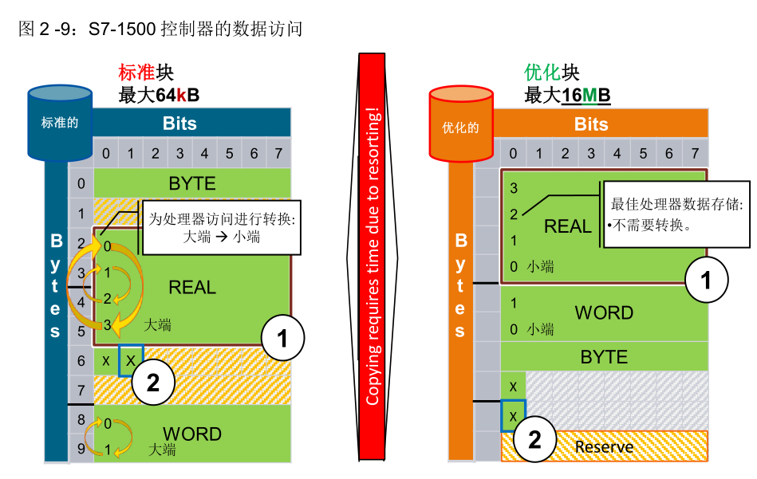
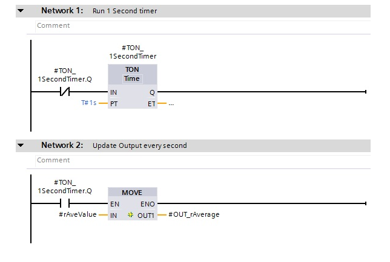

### Access unstructured data types bit-by-bit, byte-by-byte or word by word.

### 大小端数据在数据解析时存在的问题

## 配方管理

### **导出配方** RecipeExport

对于S7-1500 CPU 时，待导出的数据块可位于工作存储器中，也可位于装载存储器中。
对于 S7-1200 CPU，待导出的数据块必须位于装载存储器中。

该 CSV 文件在装载存储器中创建。对于 S7-1500 CPU，装载存储器就是存储卡；对于 S7-1200 CPU，装载存储器可以是内部或外部装载存储器（如果有存储卡）。

数据块的名称将用作所创建的CSV的名称，如果已存在同名文件则覆盖已有文件。

配方数据块类型中记录最大为5000个字节。 1200系列也会监控列数，最大255，索引列不计数。

https://www.dmcinfo.com/latest-thinking/blog/id/8862/troubleshooting-your-siemens-simatic-s7-1200-timers

Simatic AX : KRZ7VJA1PEMNN2YASUE23ABR